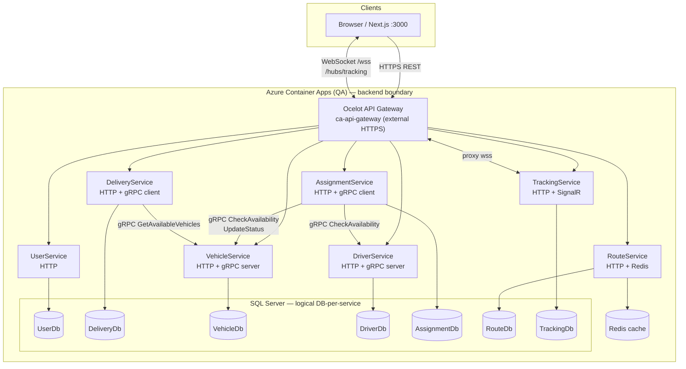

# Meridian — Architecture

Technical overview for developers onboarding to the Meridian logistics/delivery platform backend.

---

## 1. System Overview

Meridian is a **logistics and delivery management** system. The backend follows a **microservices architecture** on **.NET 10** (`net10.0`): independent deployable services, each with its own data store (database-per-service), fronted by an **Ocelot API Gateway** for external REST traffic. **gRPC** is used for selective synchronous calls between services (vehicle/driver validation and fleet queries). **SignalR** provides real-time location updates in **TrackingService** only. The stack targets **.NET** (API Gateway and services), **SQL Server 2022**, **Redis** (caching in RouteService), **JWT** authentication (HS256), and **Azure Container Apps** for QA/production-style hosting.

---

## 2. Architecture Diagram

The diagram below reflects the **logical** deployment: clients hit the gateway; services communicate via REST (through the gateway) or gRPC (service-to-service). **VehicleService** and **DriverService** expose gRPC **servers** on dedicated ports in **Development** (Kestrel dual listen). **DeliveryService** and **AssignmentService** act as **gRPC clients** only (no gRPC server in this codebase).

**gRPC method names (from `shared/protos/*.proto`):**

| Service (server) | RPCs |
|------------------|------|
| VehicleService | `GetVehicle`, `CheckAvailability`, `UpdateStatus`, `GetAvailableVehicles` |
| DriverService | `GetDriver`, `CheckAvailability`, `UpdateWorkingHours` |

---

## 3. Service Responsibilities

Local HTTP ports match **`src/ApiGateway/ocelot.Development.json`** (downstream `localhost`). The API Gateway runs at **`http://localhost:5050`** (`src/ApiGateway/Properties/launchSettings.json`).

| Service | Purpose | HTTP port (dev) | gRPC | DB config key | Notable dependencies |
|---------|---------|-----------------|------|---------------|-------------------|
| **UserService** | Registration, login, refresh, JWT issuance, users, roles | **6007** | — | `ConnectionStrings:UserDb` | DbUp migrations |
| **DeliveryService** | Deliveries CRUD, reports, vehicle recommendations | **6001** | **Client only** → VehicleService (`Grpc:VehicleServiceUrl`, default `http://localhost:7002`) | `DeliveryDb` | gRPC to VehicleService; HTTP to RouteService for distance (`ServiceUrls:RouteService`) |
| **VehicleService** | Vehicles CRUD, reports, **gRPC server** | **6002** | **Server** `7002` (`Ports:VehicleServiceGrpc`) | `VehicleDb` | Cross-DB reporting reads (see §5) |
| **DriverService** | Drivers CRUD, reports, **gRPC server** | **6003** | **Server** `7003` (`Ports:DriverServiceGrpc`) | `DriverDb` | Cross-DB reporting reads (see §5) |
| **AssignmentService** | Assignments, history, completion; validates fleet via gRPC | **6004** | **Client only** → VehicleService / DriverService — **no listening gRPC port** in app | `AssignmentDb` | gRPC clients; `HttpClient` `DeliveryService` for PATCH delivery status |
| **RouteService** | Route optimization, Google Maps, fuel-cost reports, Redis cache | **6005** | — (unused `VehicleGrpcClient` registered in DI) | `RouteDb` | EF Core migrations; Redis optional |
| **TrackingService** | REST tracking APIs + **SignalR** hub | **6006** | — | `TrackingDb` | SignalR at `/hubs/tracking` |

**Proto files:** `shared/protos/vehicle.proto`, `shared/protos/driver.proto`.

---

## 4. Inter-Service Communication

Meridian uses **REST** for almost all HTTP APIs (including traffic through Ocelot) and **gRPC** only for tight, synchronous fleet checks and vehicle listing between selected services. This section documents both.

### 4.1 REST

#### 4.1.1 Client-facing traffic (via API Gateway)

1. **Browser / Next.js** calls the **API Gateway** (e.g. `https://<gateway>/delivery/api/...`).
2. **Ocelot** strips the service prefix (`/delivery`, `/vehicle`, …) and forwards to the downstream service as `/{everything}` on the configured host/port.
3. **JWT** is validated at the gateway for routes that specify `AuthenticationOptions` with `MeridianBearer` (see Ocelot config files).

Downstream base URLs and route prefixes are summarized in [§7](#7-api-gateway-configuration).

#### 4.1.2 Gateway aggregation (REST, not Ocelot routing)

The gateway also performs **server-side HTTP** to multiple services to build a single response. **`DashboardSummaryService`** (`src/ApiGateway/Services/DashboardSummaryService.cs`) uses `IHttpClientFactory` named clients (`DeliveryService`, `VehicleService`, `DriverService`, `AssignmentService`) to page through:

| Downstream | Example paths |
|------------|-----------------|
| DeliveryService | `GET /api/deliveries?page=…` |
| VehicleService | `GET /api/vehicles?page=…` |
| DriverService | `GET /api/drivers?page=…` |
| AssignmentService | `GET /api/assignments?page=…` |

The caller’s **`Authorization` header** is copied onto each outbound request (`CreateRequest`), so downstream APIs see the same JWT as the browser would when calling those services through the gateway.

#### 4.1.3 Service-to-service REST (direct HTTP)

These calls **bypass Ocelot** and use `HttpClient` / `IHttpClientFactory` with base URLs from configuration.

| Caller | Callee | Operation | Config key(s) | Notes |
|--------|--------|-----------|---------------|--------|
| **AssignmentService** | **DeliveryService** | `PATCH /api/deliveries/{deliveryId}/status` | `Services:DeliveryServiceUrl` | Best-effort status sync when assignments are created, completed, or cancelled (`AssignmentsController.PatchDeliveryStatusAsync`). |
| **DeliveryService** | **RouteService** | `GET /api/routes/calculate?origin=…&destination=…` | `ServiceUrls:RouteService` | Distance for recommendations (`RouteDistanceService`). Default in `Program.cs` if unset is `http://localhost:6003`; **committed `appsettings.json` uses `http://localhost:6005`**, matching RouteService’s dev port in Ocelot. |
| **UserService** | **DriverService** | `POST /api/drivers` | `Services:DriverServiceBaseUrl` | Driver profile creation during account provisioning; forwards the incoming **`Authorization`** header (`DriverProvisioningClient`). |

No other microservices in this repo call each other over REST for core flows beyond the above and the gateway aggregation.

### 4.2 gRPC

#### 4.2.1 Contracts (proto)

Shared definitions live under **`shared/protos/`**:

| File | `package` | C# namespace | Generated client / server |
|------|-------------|----------------|---------------------------|
| `vehicle.proto` | `vehicle` | `Meridian.VehicleGrpc` | **VehicleService**: server (`GrpcServices="Server"`). **AssignmentService**, **DeliveryService**, **RouteService**: client (`GrpcServices="Client"`). |
| `driver.proto` | `driver` | `Meridian.DriverGrpc` | **DriverService**: server. **AssignmentService**: client only. |

**Service definitions (`service VehicleGrpc` / `service DriverGrpc`)** expose unary RPCs only (no streaming). Message shapes are defined in the same files (e.g. `VehicleRequest`, `AvailabilityResponse`, `UpdateStatusRequest`).

#### 4.2.2 Servers, ports, and HTTP/2

- **gRPC servers** are implemented only on **VehicleService** and **DriverService** (`MapGrpcService<VehicleGrpcService>()`, `MapGrpcService<DriverGrpcService>()`).
- **Development:** Kestrel listens twice: **HTTP/1.1** for REST (e.g. **6002** / **6003**) and **HTTP/2** for gRPC (**7002** / **7003**), from `Ports:VehicleServiceHttp` / `VehicleServiceGrpc` and `Ports:DriverServiceHttp` / `DriverServiceGrpc`.
- **Containers (e.g. Azure Container Apps):** `ServiceMode=GrpcOnly` listens on **8080** with **HTTP/2 only** for a dedicated gRPC app; otherwise REST uses **8080** with **HTTP/1.1** (see `Program.cs` in each service).

Clients use **h2c** (HTTP/2 without TLS) to `http://…` in development. **AssignmentService** enables `AppContext.SetSwitch("System.Net.Http.SocketsHttpHandler.Http2UnencryptedSupport", true)` in `Program.cs` so gRPC clients can speak to those URLs.

#### 4.2.3 Client registration and URLs

| Consumer | Registration | URL configuration |
|----------|--------------|---------------------|
| AssignmentService | `AddGrpcClient<VehicleGrpcClient>`, `AddGrpcClient<DriverGrpcClient>` | `Grpc:VehicleServiceUrl`, `Grpc:DriverServiceUrl` |
| DeliveryService | `AddGrpcClient<VehicleGrpc.VehicleGrpcClient>` | `Grpc:VehicleServiceUrl`, then fallbacks `ServiceUrls:VehicleGrpcService`, `ServiceUrls:VehicleService`, else `http://localhost:7002` |
| RouteService | `AddGrpcClient<VehicleGrpcClient>` | `Grpc:VehicleServiceUrl` — **registered but never injected or called** |

#### 4.2.4 Call graph (actual usage)

| Caller | Target | RPCs | Purpose |
|--------|--------|------|---------|
| **AssignmentService** | **VehicleService** | `CheckAvailability`, `UpdateStatus` | Validate vehicle before assign; move vehicle to `OnTrip` / `Available` on create, complete, cancel. |
| **AssignmentService** | **DriverService** | `CheckAvailability` | Validate driver before assign. |
| **DeliveryService** | **VehicleService** | `GetAvailableVehicles` | `VehicleRecommendationService` lists available fleet for recommendations. |
| **RouteService** | **VehicleService** | — | **No runtime calls** (dead DI registration). |

**VehicleService** implements all four vehicle RPCs against `IVehicleService` (`VehicleGrpcService.cs`). **DriverService** implements all three driver RPCs in **`DriverGrpcService.cs`**, but **`GetDriver` / `CheckAvailability` / `UpdateWorkingHours` are placeholder logic** (hard-coded or trivial responses) until wired to real repositories—callers should not rely on production-correct driver behavior over gRPC until that is replaced.

### 4.3 RouteService and Redis

RouteService uses **Redis** when `Redis:ConnectionString` or `ConnectionStrings:RedisCache` is set; otherwise it falls back to **in-memory** distributed cache (`Program.cs`). Redis is used for route-related caching, not for gRPC.

### 4.4 TrackingService and SignalR

- **Hub:** `TrackingHub` (`TrackingService.API/Hubs/TrackingHub.cs`).
- **Endpoint:** `MapHub<TrackingHub>("/hubs/tracking")`.
- Clients connect through the gateway at **`/hubs/tracking`** (WebSocket). In Development, Ocelot uses `ws` to `localhost:6006`; in QA, `wss` to the tracking app on port **443**.

JWT for SignalR can be supplied as **`?access_token=<jwt>`** on the negotiate request for paths under `/hubs/tracking` (`TrackingService` JWT bearer events).

---

## 5. Database-per-Service Ownership

| Service | Connection string key | Notes |
|---------|------------------------|--------|
| UserService | `ConnectionStrings:UserDb` | DbUp |
| DeliveryService | `DeliveryDb` | DbUp embedded SQL |
| VehicleService | `VehicleDb` | DbUp; **reporting** also uses `Reporting:DeliveryDatabaseName` (default `meridian_delivery`) and `Reporting:RouteDatabaseName` (default `meridian_route`) |
| DriverService | `DriverDb` | DbUp; **reporting** uses `Reporting:DeliveryDatabaseName` (default `meridian_delivery`) |
| AssignmentService | `AssignmentDb` | Custom SQL migration + optional `CREATE DATABASE` from `InitialCatalog` |
| RouteService | `RouteDb` | EF `MigrateAsync()` |
| TrackingService | `TrackingDb` | Custom `EnsureDatabaseAsync` + table creation |

**Rule:** Each service should own **one** database and access it only through its own connection string. **Physical database names are deployment-time values** in connection strings (not hardcoded in committed `appsettings.json`).

**Confirmed violation (bug):** VehicleService and DriverService **report** SQL references **another** database (e.g. `delivery_db.dbo.Deliveries`). On **Azure SQL Database**, this can fail with:

`Reference to database and/or server name in 'delivery_db.dbo.Deliveries' is not supported in this version of SQL Server.`

Fix direction: remove cross-database queries or use an approved pattern (e.g. APIs, replication, or elastic query), not direct three-part names in SQL.

---

## 6. Authentication & Authorization

### 6.1 Mechanism

- **Algorithm:** JWT **HS256** (symmetric key).
- **Gateway scheme:** **`MeridianBearer`** (Ocelot `AuthenticationProviderKey`).
- **Issuance:** **UserService** — `POST /api/auth/login` (and register/refresh) returns access tokens consumed by other services.

### 6.2 Roles

Defined in **`UserService.API.Models.Role`:** **Admin**, **Dispatcher**, **Driver**.

**Manager** appears in `[Authorize(Roles = "...")]` on **report** endpoints across services but is **not** in `Role.GetAll()` — treat as a **claim/role** your identity pipeline must issue if you use those endpoints.

### 6.3 Access summary

| Role(s) | Typical access |
|---------|----------------|
| **Admin** | User CRUD, role listing, driver account provisioning, full vehicle/driver management |
| **Dispatcher** | Deliveries, assignments, fleet reads, dispatch tracking views |
| **Driver** | Driver-scoped vehicle/driver endpoints, assignment lookup, tracking hub send location |
| **Manager** | Report endpoints where `Admin,Dispatcher,Manager` is specified |

**Any authenticated user:** `GET /api/users/me`, `GET /api/users/{id}` (self or admin), `POST /api/auth/revoke`, `POST /api/auth/logout` — `[Authorize]` without role list where applicable.

### 6.4 Public endpoints (no `[Authorize]`)

- `POST /api/auth/register`, `POST /api/auth/login`, `POST /api/auth/refresh` — **UserService**
- **RouteService** `RoutesController` — **no** `[Authorize]` on any action (public HTTP API for route optimization in this codebase)

All other API surfaces described in controllers generally require JWT unless explicitly left open.

### 6.5 SignalR

For hub paths starting with `/hubs/tracking`, the access token may be read from the **`access_token`** query parameter (`TrackingService` JWT configuration).

---

## 7. API Gateway Configuration

### 7.1 File selection (`src/ApiGateway/Program.cs`)

- **Development:** `ocelot.Development.json` (localhost, **HTTP** / **ws**).
- **Other environments:** `ocelot.{EnvironmentName}.json` if present.
- **Fallback:** `ocelot.json`.

### 7.2 Route prefix table (upstream)

| Downstream | Upstream prefix(es) on gateway |
|------------|----------------------------------|
| **UserService** | `/user/swagger`, `/user/swagger/{everything}`, `/api/auth/{everything}`, `/api/users/{everything}`, `/api/roles/{everything}` |
| **DeliveryService** | `/delivery/swagger`, `/delivery/swagger/{everything}`, **`/delivery/{everything}`** |
| **VehicleService** | `/vehicle/swagger`, `/vehicle/swagger/{everything}`, **`/vehicle/{everything}`** |
| **DriverService** | `/driver/swagger`, `/driver/swagger/{everything}`, **`/driver/{everything}`** |
| **AssignmentService** | `/assignment/swagger`, `/assignment/swagger/{everything}`, **`/assignment/{everything}`** |
| **RouteService** | `/route/swagger`, `/route/swagger/{everything}`, **`/route/{everything}`** |
| **TrackingService** | `/tracking/swagger`, `/tracking/swagger/{everything}`, **`/tracking/{everything}`**, **`/hubs/tracking`** (WebSocket) |

Downstream path template for most APIs: **`/{everything}`** (prefix stripped).

### 7.3 `ocelot.json` vs `ocelot.QA.json` vs `ocelot.Development.json`

| Aspect | `ocelot.Development.json` | `ocelot.json` / `ocelot.QA.json` |
|--------|---------------------------|----------------------------------|
| **Downstream hosts** | `localhost` + ports **6001–6007** | `https` + **`${USER_SERVICE_HOST}`** etc. (env placeholders), port **443** |
| **Scheme** | `http`; WebSocket `ws` | `https`; WebSocket **`wss`** for `/hubs/tracking` |
| **BaseUrl** | `http://localhost:5050` | `${OCELOT_BASE_URL}` |

Environment-specific values are substituted at startup (see `Program.cs` replacement dictionary).

### 7.4 WebSocket / SignalR

- **Development:** `/hubs/tracking` → `ws://localhost:6006/hubs/tracking`.
- **QA template:** `/hubs/tracking` → `wss://` downstream host port **443**.

---

## 8. Azure Deployment Topology (QA)

Named resources align with **`.github/workflows/qa-cicd.yml`** and environment conventions:

| Resource | Name / note |
|----------|-------------|
| Resource group | `rg-meridian-qa` |
| Container Apps environment | `cae-meridian-qa` |
| Azure Container Registry | `acrmeridianqa` |
| SQL Server | `sql-meridian-qa001` |
| Redis | Provisioned per environment; workflow may set `REDIS_ENDPOINT` (verify current secrets in `qa-cicd.yml`) |
| API Gateway app | `ca-api-gateway` — **external** ingress (public HTTPS) |
| Other services | Internal ACA apps — **internal** ingress; not directly exposed publicly |

**Service discovery:** Downstream hosts in `ocelot.QA.json` are **environment-variable placeholders** (e.g. `${DELIVERY_SERVICE_HOST}`) resolved at **deploy** time to internal ACA FQDNs.

### CI/CD (GitHub Actions — QA)

- **Trigger:** Push to `develop` (and manual `workflow_dispatch`).
- **Image tag:** First **12** characters of **`GITHUB_SHA`** (unless overridden).
- **Build:** `docker buildx` **push** to **ACR** (`acrmeridianqa.azurecr.io/...`).
- **Deploy:** `deploy-qa` job updates **Azure Container Apps** in `rg-meridian-qa` with the new image tags.

**Secrets:** Azure OIDC (`AZURE_CLIENT_ID`, `AZURE_TENANT_ID`, `AZURE_SUBSCRIPTION_ID`), `DB_PASSWORD`, and other app-specific secrets as referenced in workflows.

---

## Related paths

| Topic | Location |
|-------|----------|
| Ocelot routes | `src/ApiGateway/ocelot.json`, `ocelot.QA.json`, `ocelot.Development.json` |
| Gateway startup | `src/ApiGateway/Program.cs` |
| gRPC protos | `shared/protos/vehicle.proto`, `shared/protos/driver.proto` |
| QA workflow | `.github/workflows/qa-cicd.yml` |
